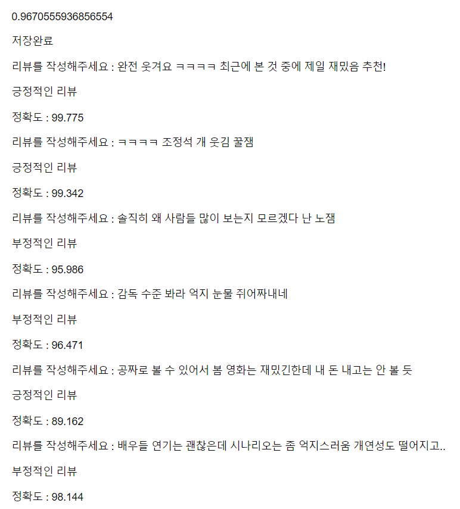
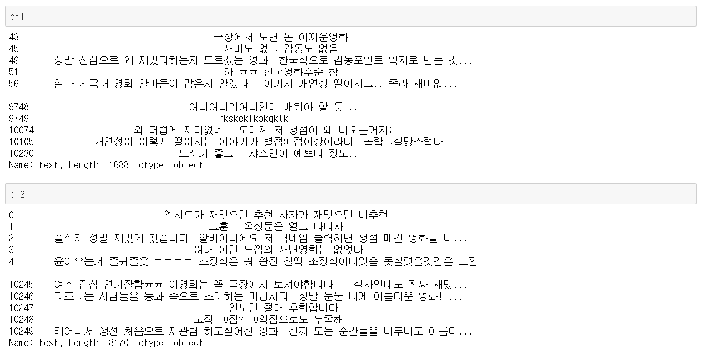
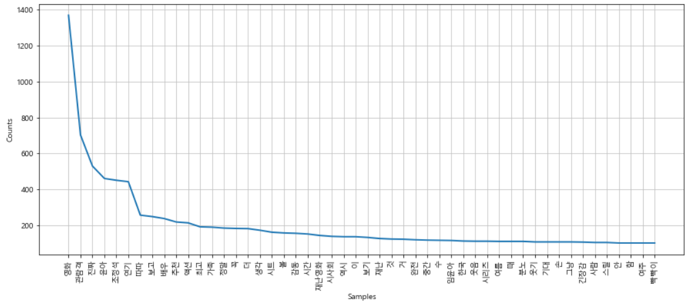
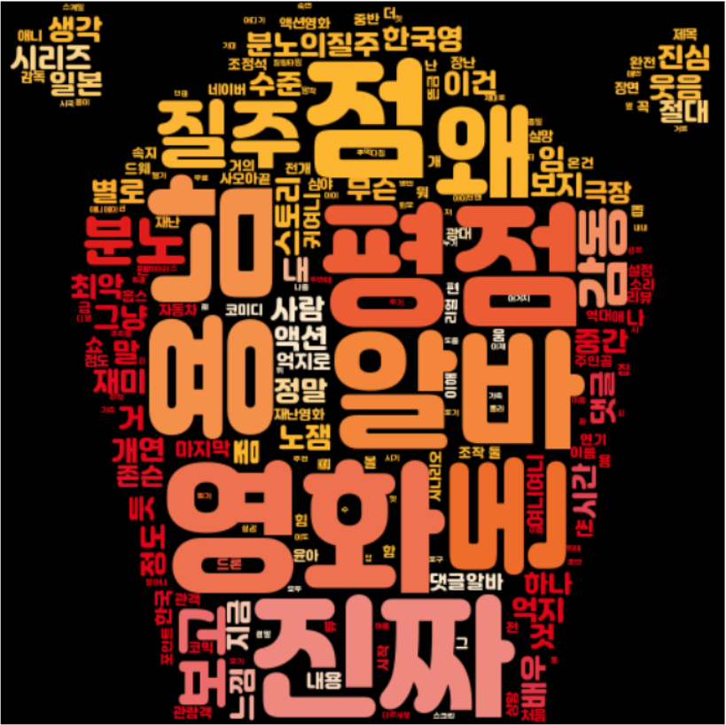

#  자연어 처리 및 감정 분석

> 2019.08 / 2019 국가 수리과학 연구소 산업수학 세미나
> 
> 분석 모델 : https://bit.ly/3wFVACJ
> 
> 시각화 : https://bit.ly/3vArvDf


## 목적

- 네이버 영화 댓글 데이터를 활용하여 텍스트 긍정 부정 예측 모델 개발
- 긍정, 부정어를 통해 영화 제작 및 마케팅에서 활용한 참고 자료로서 활용 가능


## 개요

1. ML
   - step1. 네이버 영화 메인 페이지(현재 상영작) 에서 1~10위 영화의 상세페이지 주소 크롤링
   - step2. 상세페이지에서 평점의 더보기를 클릭했을 때 보여지는 페이지 주소 크롤링
   - step3. 140자 평을 1페이지~끝 페이지 순회하면서 평점과 리뷰를 크롤링
   - step4. 학습을 위한 데이터 전처리
   - step5. 학습. 학습된 모델을 파일로 저장
   - step6. 저장된 모델을 불러와 사용
2. 시각화
   - step1. 데이터를 가져와서 스코어를 기준으로 긍정,부정 리뷰를 나눔
   - step2. 나누어진 리뷰데이터를 형태서 분석하여 명사를 토큰화한다.
   - step3. 토큰화 된 명사중에서 자주 나오는 50개의 단어를 확인
   - step4. 해당 단어의 빈도수를 표현하는 차트 생성
   - step5. 자주 나오는 500개의 단어로 워드 클라우드 생성


## 상세 내용_긍/부정어 분류 모델(ML)

> 전체 코드 내용은 html 파일, pdf로 확인 가능

 

#### 1. 주소, 댓글, 별점 크롤링

```python
def step1_get_detail_url() :
    # 접속할 페이지의 주소 네이버 영화 메인 페이지
    site = 'https://movie.naver.com/movie/running/current.nhn?order=reserve'

    # requests를 이용해 해당 URL에 접속한다
    response = requests.get(site)   

    # 영화 페이지를 크롤링한다
    bs = BeautifulSoup(response.content, 'html.parser')

    # a 태그들을 가져온다.
    a_list = bs.select('.top_thumb_lst a')

    # href 속성을 가져온다.
    df = pd.DataFrame()
    for idx in range(10) :       # 상위 10개만 가져오기
        href = a_list[idx].get('href')
        
        # 가져온 href 속성의 주소를 분석한 객체를 생성한다.
        a1 = parse.urlparse(href)
        
        # 주소를 분석한 객체서 쿼리 스트링을 가져온다(? 이후)
        query_str = parse.parse_qs(a1.query)
        
        # 추출한 쿼리스트링 데이터에서 원하는 파라미터 데이터를 추출한다.
        code = query_str['code'][0]
        print(code)

        df = df.append([[code]], ignore_index=True)

    df.columns = ['code'] #추출한 10개 영화 코드를 저장한다.
    df.to_csv('movie_code_list.csv', index=False, encoding='utf-8-sig') #코드를 CSV로 저장
    print('주소 저장 완료')
step1_get_detail_url()
```


#### 2. 평점 전처리

- 대부분 평점을 후하게 주는 경향있고, 평점 평균이 우측에 편향되어 있어서 7점을 기준으로 부정적 리뷰, 긍정적 리뷰로 판단

```python
# 140자평 데이터 전처리 함수
def text_preprocessing(text) :
    if text.startswith('관람객') :
        return text[3:]
    else :
        return text
    
# 평점 전처리 함수
def star_preprocessing(text) :
    value = int(text)

    if value <= 7 :
        return '0'
    else :
        return '1'
```


#### 3. 모델 학습

- 70%는 학습, 30%는 test data로 나눈다.

```python
def step4_data_preprocessing() :
    # 수집한 데이터를 읽어온다.
    df = pd.read_csv('star_score.csv')

    # 전처리를 수행한다.
    df['text'] = df['text'].apply(text_preprocessing)
    df['score'] = df['score'].apply(star_preprocessing)

    # 독립변수, 종속변수
    text_list = df['text'].tolist()
    star_list = df['score'].tolist()

    from sklearn.model_selection import train_test_split

    # 70%는 학습, 30%는 test
    text_train, text_test, star_train, star_test = train_test_split(text_list, star_list, test_size=0.3, random_state=0)

    return text_train, text_test, star_train, star_test
```


#### 4. 형태소 분석

```python
# 형태소 분석을 위한 함수
def tokenizer(text) :
    okt = Okt() # 한국어 자연어 처리 라이브러리
    return okt.morphs(text)
```


#### 5. ML

- **tfidf** : 전체 문서 내 특정 단어의 빈도수를 계산하여 벡터화
- **logistic** : 선형 회귀 분석

```python
def step5_learning(X_train, y_train, X_test, y_test):
    # 주어진 데이터를 단어 사전으로 만들고 각 단어의 빈도수를 계산한 후 벡터화 하는 객체 생성
    tfidf = TfidfVectorizer(lowercase=False, tokenizer=tokenizer) 

    # 문장별 나오는 단어수 세서 수치화, 벡터화해서 학습을 시킨다. 회귀분석 이용
    logistic = LogisticRegression(C=10.0, penalty='l2', random_state=0)

    pipe = Pipeline([('vect', tfidf), ('clf', logistic)])

    # 학습한다.
    pipe.fit(X_train, y_train)

    # 학습 정확도 측정
    y_pred = pipe.predict(X_test)
    print(accuracy_score(y_test, y_pred))

    # 학습된 모델을 저장한다.
    with open('pipe.dat', 'wb') as fp :
        pickle.dump(pipe, fp)
        
    print('저장완료')
```


#### 6. 결과

- 사용자가 입력한 텍스트가 긍정인지 부정인지 분류하고, 분석 정확도를 출력한다.
- 장점 : '노잼' 과 같이 은어, 줄임말, 유행어도 무리 없이 분석이 가능하다
- 단점 : '공짜로 볼수 있어서 봄~~' 댓글 같은 경우 명백한 부정어가 없이 '재미' 라는 긍정어가 포함되어 있어서 부정 리뷰임에도 긍정으로 판단되었다. 문맥의 의미를 파악하는 것은 아니었기에 부정확한 결과가 나왔다.




## 상세 내용_긍/부정어 워드클라우드(시각화)

> 전체 코드 내용은 html 파일, pdf로 확인 가능


#### 1. 스코어 기준 긍/부정 라벨링

- 보다 정확한 결과를 통해 애매한 점수는 분류 대상에서 제외

```python
df1=df[df.score<5] #0~4점은 부정
df2=df[df.score>7] #8~10점은 긍정
```




#### 2. 형태소 분석, 등장 횟수 상위 50개 명사 추출

```python
pos= ''

for each_line in df2[:4000]:
    pos = pos + each_line + '\n'
     
tokens_pos = t.nouns(pos) #형태소 분석 Okt
tokens_pos[0:10]

po = nltk.Text(tokens_pos, name='영화')
print(len(po.tokens))
print(len(set(po.tokens)))

pos_data=po.vocab().most_common(50) # 최빈 단어
pos_data

plt.figure(figsize=(15,6))
po.plot(50)
plt.show() #긍정 리뷰에서 많이 나오는 단어
```




#### 3. 최빈 단어 500개로 워드클라우드 시각화

- 원하는 이미지의 모양대로 워드 클라우드 생성 가능
- 폰트 및 색상도 커스텀 가능

```python
mask = np.array(Image.open('popcorn.png'))
from wordcloud import ImageColorGenerator
image_colors = ImageColorGenerator(mask)

image_colors

pos_data = pos.vocab().most_common(500)
# for win : font_path='c:/Windows/Fonts/malgun.ttf'
wordcloud = WordCloud(font_path='c:/Windows/Fonts/jalnan.ttf',
               relative_scaling = 0.1, mask=mask,
               background_color = 'white',
               min_font_size=1,
               max_font_size=100).generate_from_frequencies(dict(pos_data))

default_colors = wordcloud.to_array()

plt.figure(figsize=(12,12))
plt.imshow(wordcloud.recolor(color_func=image_colors), interpolation='bilinear')
plt.axis('off')
plt.show() #긍정 워드클라우드
```


- 긍정어 워드 클라우드 결과


- 부정어 워드 클라우드 결과




## 결론 및 배운점

- 영화 댓글 데이터로 분석을 해서, 영화 댓글이 아닌 다른 데이터의 감정 분석에는 부족한 한계점이 있다.
- 하지만 영화 데이터 처럼 특정 기준에 의해 긍부정을 명확히 나눌수 있다면 모델 학습에 활용이 가능할 것으로 생각된다.(영화에서는 별점)
- 또한 긍정, 부정어에 자주 등장하는 단어를 통해 향후 영화를 제작할 때 참고하거나 마케팅 및 프로모션을 참고할 때 소구 포인트로 사용하면 좋을 것 같다. 반면에 부정어로 자주 등장하는 단어들은 그 요소들을 지양하며 영화를 제작하는 것도 도움이 될 것 같다.
- 크롤링, 선형회귀 분석, 자연어 처리, 형태소 분석에 대한 전반적인 이해를 가지게 되었다.
- 댓글 분석에서 명사를 추출하는것이 정확할 것이라고 판단하였지만, 실제 댓글을 살펴보니 사용자의 실제 감정과 관련된 형태소는 동사나, 형용사라는 것을 알게 되었다.
- 다음 감성분석에서는 동사, 형용사 위주로 데이터를 추출하는 것이 좋을 것 같다.
- 한계점으로는, 일반 사용자가 입력하다보니 오타나 축약어는 형태소 분석이 불가 하다는 것이다. ML으로 긍정부정어 분류는 가능하지만 형태소 분석에 걸리지 않아 누락되는 데이터가 생긴다.
- 한국어 긍부정 단어 사전이 있다면 정확도가 높을 것 같다.

